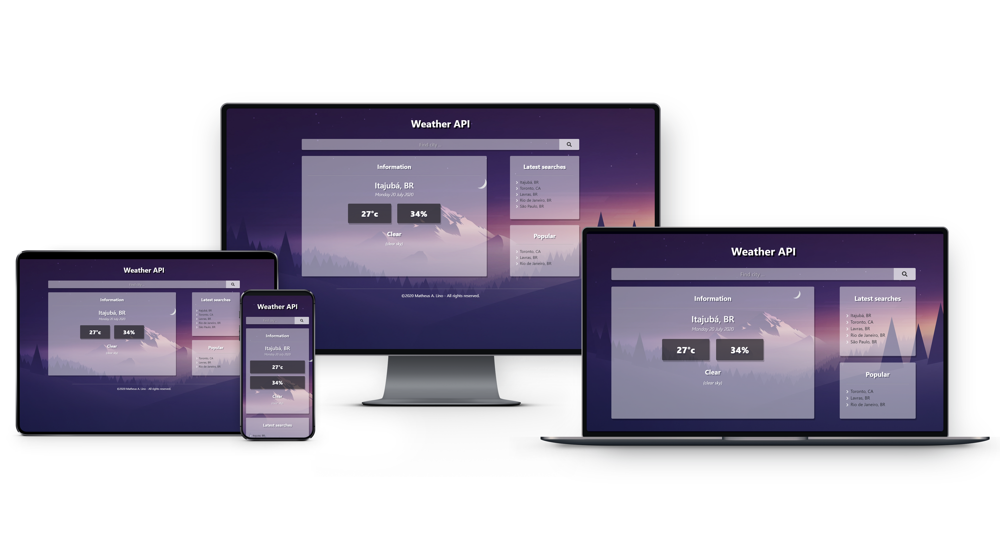

# Weather API
Get information about the weather via OpenWeatherMap API.

### About
Simple application demonstrating how to integrate Bootstrap classes, Reactstrap Components in a ReactJS project. The App dinamically calls the endpoints, getting all data, such as temperature, country, humidity and all other information related.

### Developed with:
* TypeScript
* Fetch API
* ReactJS
* HTML5
* CSS3
* Bootstrap (reactstrap)

### Screens


### Preview
* **Download:** you can download the source-code and run it on your local machine, as long as you have a network connection.

### Installation and how to use

First clone the project.
```
https://github.com/matheuslino/Weather-App.git
````

Then install the dependencies
```
npm install
````

Open the ```src/``` folder and start the App with the following command:
```
npm start
```

### Version
> Release: `2.0.0`

### License
MIT License
